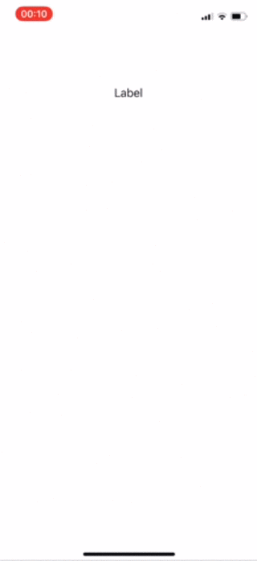

# Label Picker

Example project where we make a label show/hide a UIPickerView on each tap.

The basic gist is:

* Create a UILabel on the storyboard
* Subclass UILabel & make the label use that class
* Override two properties to make sure the label receives the tap & can become the first responder
    * `canBecomeFirstResponder`
    * `isUserInteractionEnabled` (This **should** be settable from Storyboard)
* Make `UILabelSubclass.inputView` property settable & assign something like `UIPickerView` to it
* Listen for `touchesEnded(_:with:)` & call `becomeFirstResponder` when it receives a tap.
    * As we want to show/hide then we check if we're already first responder and resign if we are in this case

## Screen recording?

Pretty boring, but sure, why not.

## How did you figure this out?!

Little bit of reading the docs, little bit of googling and a lot of time trying various things. Understanding first responder is essential, and the magic key that I was missing? The default first responder for `UIView` presenting whatever is in `UIView.inputView`.

Useful links in no particular order:

* <https://github.com/pietrorea/PRLabel/blob/master/Classes/PRLabel.m>
* <https://developer.apple.com/library/content/documentation/StringsTextFonts/Conceptual/TextAndWebiPhoneOS/ManageTextFieldTextViews/ManageTextFieldTextViews.html>
* <http://stephengroom.co.uk/uikit/showing-ios-keyboard-without-text-input/>
* <https://stackoverflow.com/questions/12849146/uilabel-doesnt-show-inputview/23297991#23297991>

## License

See `LICENSE`, tldr; Apache 2.0
